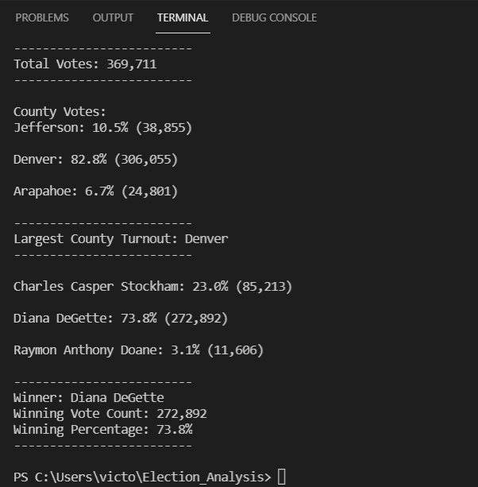

# Election_Analysis - Module 3 Challenge

## Overview of Election Audit:
Assisting a Colorado Board of Elections employee, in an election audit of the tabulated results for U.S. Congressional precinct in Colorado. The election commission has requested some additional data to complete the audit:
- The voter turnout for each county
- The percentage of votes from each county out of the total count 
- The county with the highest turnout

## Election-Audit Results:
### How many votes were cast in this congressional election?
- 369, 711 total votes were cast in this congressional election. 

### Breakdown of the number of votes and the percentage of total votes for each county in the precinct
- Jefferson County: 38,855 votes, 10.5% of the total votes
- Denver County: 306,055 votes, 82.8% of the total votes
- Arapahoe County: 24,801 votes, 6.7% of the total votes

### Which county had the largest number of votes?
- Denver County: 306,055 votes

### Provide a breakdown of the number of votes and the percentage of the total votes each candidate received.
- Charles Casper Stockham: 23.0% (85,213 votes)
- Diana DeGette: 73.8% (272,892 votes)
- Raymon Anthony Doane: 3.1% (11,606 votes) 

### Which candidate won the election, what was their vote count, and what was their percentage of the total votes?
- Diana DeGette won the election with 73.8% of the total vote (272,892 votes)

### See image below for overview of results:

## Election-Audit Summary: 
Overall this is a useful script that can be modified and used on any election data. For example, this script can be used to analyze data from previous years. To do this the code would have to be modified to pull the data from another csv File. Once the script is complete and results are printed, we can compare the differences in voter turnout for each County over the years. 
